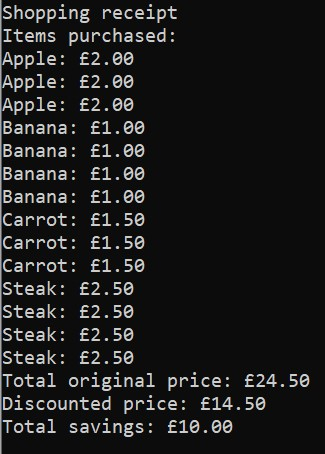

# Checkout program 

- The program calculates the total discounted price of all shopping items given in the csv file 
`src/main/resources/checkout_items.csv` 
under the directory `src/main/resources`. 

- Items able to be bought:
    - Apple: `item-id: apple-1, group-id: fruit-1`
    - Banana: `item-id: banana-1, group-id: fruit-1`
    - Carrot: `item-id: carrot-1, group-id: vegetable-1`
    - Steak: `item-id: steak-1, group-id: meat-1`
    
- The applicable discounts are based off of 4 rules and can be configured in 
  `src/main/resources/rule-config.yml`. 
  - Each item can only have one discount applied. The program checks to see which discounts are applicable
  and calculates which is best and applies it.
  
- Discounts applicable:
    - ThreeForTwo: Buy any 3 equal priced items for the price of 2
    - BuyTwoEqualSpecialPrice: Buy 2 equal priced items with the same item-id,
     e.g. `apple-1` for a special price (This is configured in the `rule-config.yml`)
    - BuyThreeSameGroupIdCheapestFree: Buy 3 items with the same `group-id` and the cheapest is free, e.g.
    buy 2 bananas and 1 apple, and the cheapest out of the 3 will be free
    - BuyNGetYFree: Buy N items and get Y items free, e.g. Buy 3 bananas and get 3 apples free.

## Run the project
- Install Maven if not installed already: https://maven.apache.org/download.cgi
- From the root directory, run `mvn clean package`, this will build the project and create the artifact.
- This will create the jar file under the folder `target/checkout-program-1.0.0-shaded.jar` which 
you can run the program

- Run the following command:
`java -jar target/checkout-program-1.0.0-shaded.jar src/main/resources/checkout_items.csv rule-config.yml`

```
* The configuration 'checkout_items.csv' file has the items:
* 3 Apples, 2.00 each
* 4 Bananas, 1.00 each
* 3 Carrots, 1.50 each
* 4 Steaks, 2.50 each
* The BEST discount rules to be applied from the 'rule-config.yml' are
* BuyNGetYFree: Buy 3 bananas and get 3 apples free (6.00 discount)
* BuyThreeSameGroupIdCheapestFree: Buy 3 group-id 'vegetable-1' and get cheapest free; 3 carrots were bought,
* therefore the price of 1 carrot is free (1.50 discount)
* ThreeForTwo: Buy 3 steaks for the price of 2, (2.50 discount)
* Total savings: 10.00
* Total original price: 24.50
* New discounted price: 14.50
```

## Output:

<p>
    
</p>
